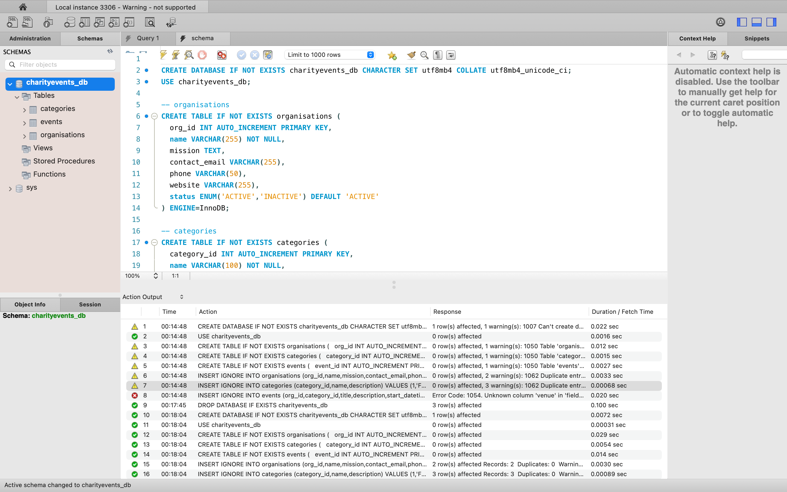
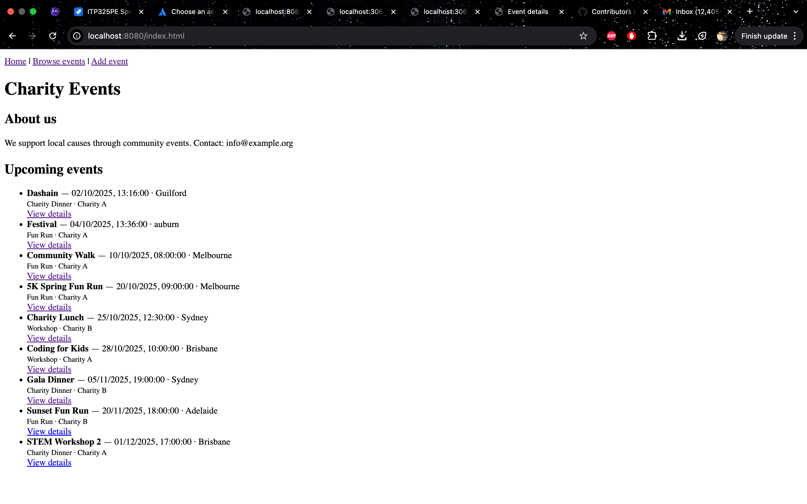
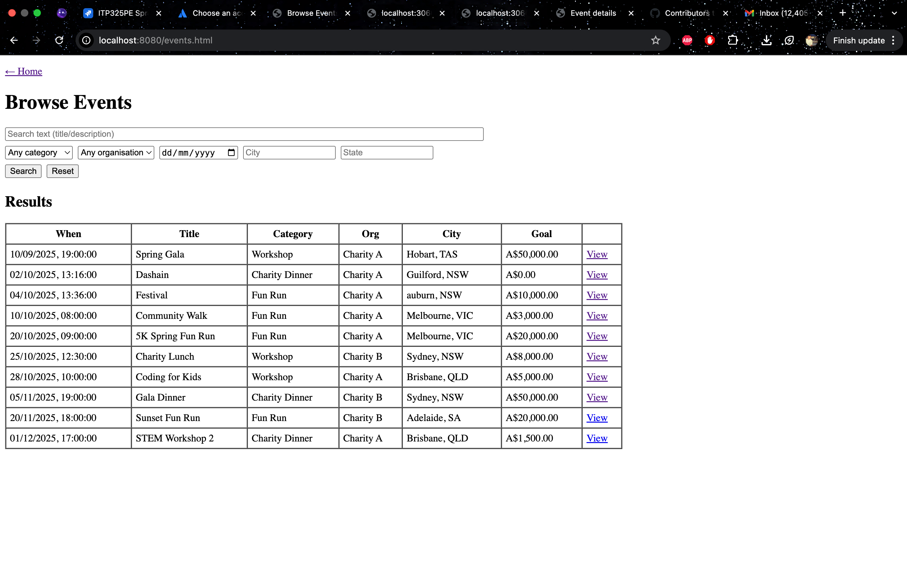
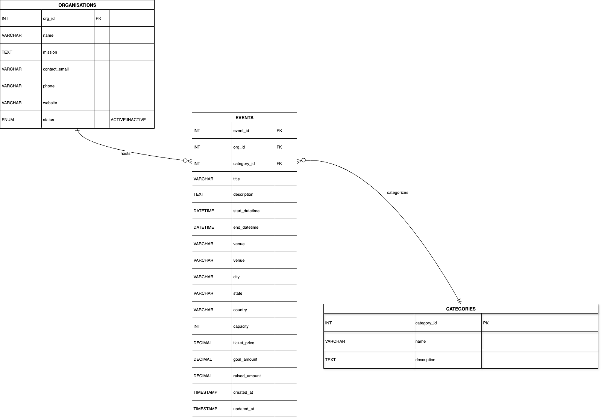

# Charity Events — Node.js + MySQL (API & Web)

Two small Node.js apps:

- **API** (Express + MySQL): CRUD endpoints for charity events  
- **WEB** (Express static site): HTML/JS pages that consume the API

> ✅ Per unit requirement: **No Angular / AngularJS** used.

---

## 1) Prerequisites

- **Node.js** 18+ (22 works)
- **MySQL** 8.x on `localhost:3306`
- *(Optional)* **MySQL Workbench** for running SQL

---

## 2) Database Setup

Create DB, tables, and seed data via the SQL script.

**Workbench (GUI)**
1. Open **`API/schema.sql`**
2. Click the **⚡ Execute** button.

**CLI**
```bash
mysql -u root -p < API/schema.sql


3) Environment Files

Create .env files for both apps (do not commit your real .env).

API/.env

PORT=3060
NODE_ENV=development
DB_HOST=127.0.0.1
DB_PORT=3306
DB_USER=root
DB_PASSWORD=your_mysql_password
DB_NAME=charityevents_db


WEB/.env

PORT=8080
NODE_ENV=development
API_BASE=http://localhost:3060/api


Tip: Keep .env in .gitignore. Optionally commit .env.example with placeholders.


4) Install & Run

Open two terminals.

API

cd API
npm install
npm run dev       # http://localhost:3060


WEB

cd WEB
npm install
npm run dev       # http://localhost:8080


Open http://localhost:8080
:

Browse events → /events.html

Event detail → /event.html?id=1

Add event → /add.html


5) What’s Implemented

Search (text/category/org/date/city/state) → /events.html

View single event with progress bar → /event.html?id=…

Create event with HTML5 validation → /add.html (POST to API)

The API supports GET list, GET by id, POST, PUT, DELETE.
(UI currently covers list/detail/create; edit/delete can be added easily.)


6) API Overview

Base: http://localhost:3060/api

GET /events — filters: q, category, org, city, state, date (YYYY-MM-DD), after (ISO)

GET /events/:id — single event (includes category_name, org_name)

POST /events — required: org_id, category_id, title, start_datetime (ISO)

PUT /events/:id — partial updates allowed

DELETE /events/:id — delete event

Errors: { "error": "message" } with appropriate HTTP codes.


7) Repo Structure
API/
  routes/
    events.js
  app.js
  db.js
  schema.sql
  package.json
  .env.example
WEB/
  public/
    index.html
    events.html
    event.html
    add.html
    js/
      events.js
      event.js
      add.js
    css/
  server.js
  package.json
  .env.example
README.md
.gitignore


8) Demo Checklist (for video)

Show charityevents_db tables in Workbench.

Start API (3060) and WEB (8080).

/events.html: run searches (text, category, date).

Open a result → /event.html?id=….

/add.html: create a new event → redirected to detail page.

Show the new row in Workbench.

Briefly explain your ERD (organisations, categories, events).


9) Troubleshooting

Port in use

lsof -i :8080     # or :3060
kill -9 <PID>


## Screenshots

### Database tables (MySQL Workbench)


### Home page


### Search page


### ERD



DB connection: verify API/.env credentials & DB_NAME.

CORS: API enables cors(); ensure WEB/.env API_BASE matches the API URL.

Datetime: datetime-local values are converted to ISO in add.js before POST.


Author: Poojaya Kumar Mahato


Repo: https://github.com/poojaya/webdev-2-assesment